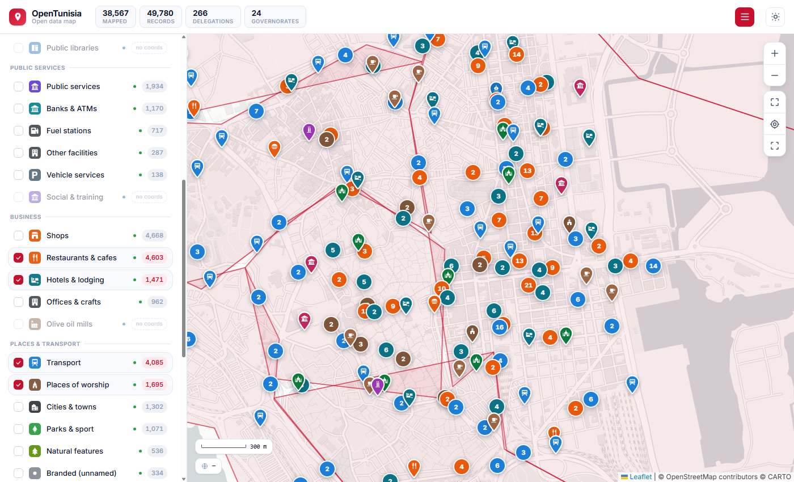

# OpenTunisia map viewer

An interactive map of everything in this repository that has coordinates:
**38,567 points** across 28 layers, on top of all **266 delegation boundaries**.



## Run it

The page fetches JSON, so it needs to be served over HTTP. Opening `index.html`
directly from the filesystem will be blocked by the browser.

```bash
cd viewer
python -m http.server 8000
# then open http://localhost:8000
```

Any static server works, and the folder can be published as-is to GitHub Pages,
Netlify or any static host.

## What it shows

- **266 delegation polygons.** Hover for the name, click for Arabic name and code.
- **28 point layers** grouped by theme (health, education, public services, business,
  places, culture, agriculture), each labelled with its record count and its source.
- **Green = OpenStreetMap, blue = government data**, so you can always see where a
  point came from. The same distinction appears on every popup.
- **The map starts clean.** Only Tunisia's 266 delegation boundaries are drawn; no
  markers appear until you pick a layer. Your selection is remembered between visits.
- **Category icons.** A pharmacy, hotel, mosque, station or hospital is identifiable
  without opening its popup. 39 solid-filled glyphs, colour-coded, with a per-layer
  fallback for the long tail (the data holds 430 distinct type values).
- **Places of worship follow their faith.** OSM's `religion` tag selects the glyph:
  mosque (1,578), church (26), synagogue (12). Untagged entries default to a mosque,
  which is the overwhelming majority in Tunisia.
- **Clickable pins** with a real hit target, hover growth, keyboard focus and a native
  tooltip showing the name.
- **Useful popups.** Phone as a `tel:` link, website, *Open in OSM*, *Directions*, and
  *Copy coords*.
- **Search** across every loaded point by name (3+ characters, capped at 300 results).
- **Jump to governorate** to zoom to any of the 24.
- **Light and dark themes**, with a matching basemap for each.
- **Map tools.** Scale bar, live coordinate readout, *fit Tunisia*, *find my location*
  and fullscreen. Press `/` to jump to search, `Esc` to clear it.

### Background modes

The standard OpenStreetMap basemap draws its own shops, restaurants, streets and labels,
which compete with the data this project collected. At city zoom it becomes impossible
to tell which points are OpenTunisia's. Three backgrounds are provided:

| Mode | What the background shows | Use it for |
|---|---|---|
| **Plain** (default) | Land, water and coastline only | Seeing OpenTunisia data on its own |
| **Place names** | Adds city and town labels, still no POIs | Orientation without clutter |
| **Full OSM** | The complete OSM rendering | Comparing this data against OSM's |

Plain is the default deliberately: on it, **every marker on the map is a record from this
repository.** The choice is remembered between visits.

Layers marked *no map data* are datasets whose source publishes addresses but no
coordinates. They are in the repository, they simply cannot be drawn. Hovering the
label explains this.

## Rebuilding the data

`build.py` reads `../data/` and writes the three files the page loads:

```bash
cd viewer
python build.py
```

| Output | What it is |
|---|---|
| `boundaries.json` | Delegation polygons, simplified for display |
| `points.json` | Every coordinate-bearing record, in a compact array form |
| `stats.json` | Governorate list and headline totals |

Re-run it after changing anything in `data/`.

### Why the data is transformed

The repository's raw files are not suitable to load directly into a browser:

- **Boundaries are simplified** with Douglas-Peucker at ~220 m tolerance, taking the
  delegation polygons from 274,257 vertices (5.4 MB) to 15,619 (0.31 MB). At country
  and governorate zoom the difference is not visible, and it is the difference between
  a map that loads instantly and one that stalls.
- **Points are packed into arrays** rather than objects: `[lat, lon, name, type,
  delegation, governorate, phone, website]`. Repeating JSON keys 38,567 times costs
  several megabytes for nothing.
- **Records without coordinates are excluded** from `points.json` and reported per
  layer instead, so a dataset that cannot be mapped is shown as such rather than
  silently appearing empty.

## Built with

- [Leaflet](https://leafletjs.com/) 1.9.4, BSD-2-Clause
- [Leaflet.markercluster](https://github.com/Leaflet/Leaflet.markercluster) 1.5.3, MIT
- Basemap tiles: [OpenStreetMap](https://www.openstreetmap.org/) (light) and
  [CARTO](https://carto.com/basemaps/) dark matter (dark)

No build step, no framework, no bundler: one HTML file and three JSON files.

## Attribution

The data shown is **© OpenStreetMap contributors** (ODbL) and Tunisian government open
data under various open licenses. Any reuse must carry the same attribution. See
[`../sources/`](../sources/) for the license of each dataset.
